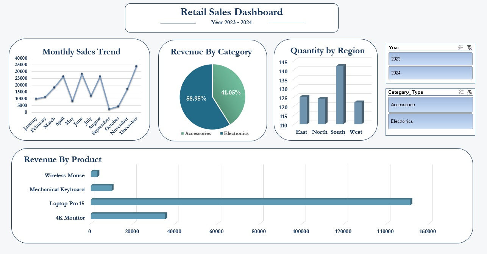
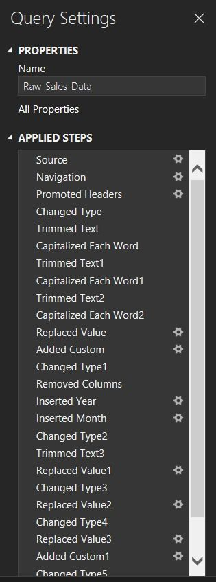
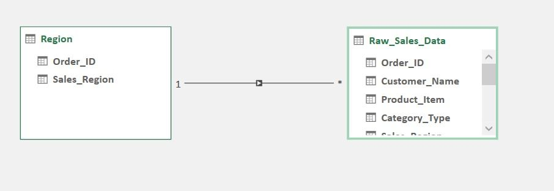

# retail-sales-analysis-dashboard
# Retail Sales Analysis & Interactive Excel Dashboard

This project analyzes retail sales data and presents the results through an interactive Excel dashboard.

## Project Overview

The dataset required cleaning and transformation before analysis. I used Power Query to prepare the data, Power Pivot to build the data model, and DAX to create analytical measures.

The final dashboard allows users to explore retail performance through interactive charts and filters.

## Tools Used

- Microsoft Excel
- Power Query
- Power Pivot
- DAX
- PivotTables
- PivotCharts

## Data Cleaning

The cleaning process included:

- Standardizing customer and product information
- Cleaning category names
- Handling inconsistent date formats
- Cleaning quantity and price fields
- Handling missing values
- Creating calculated sales fields

## Analysis

The dashboard analyzes:

- Monthly sales trends
- Revenue by category
- Quantity sold by region
- Top-performing products

## Dashboard

## Data Preparation

## Data Model

